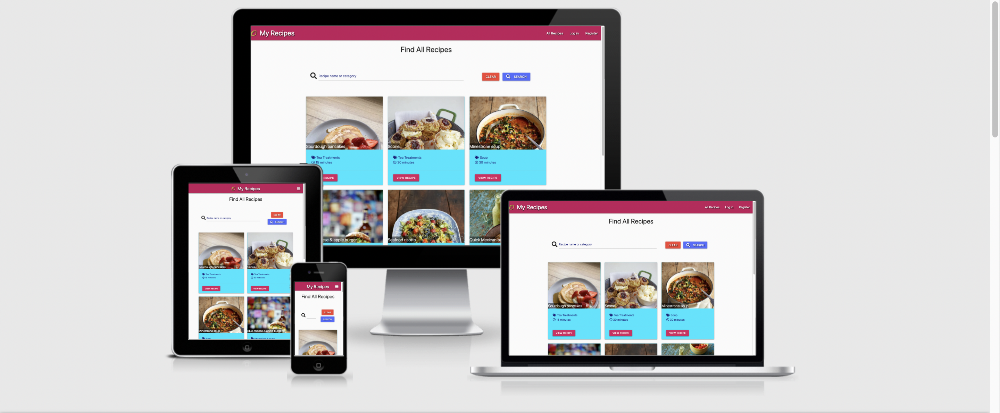
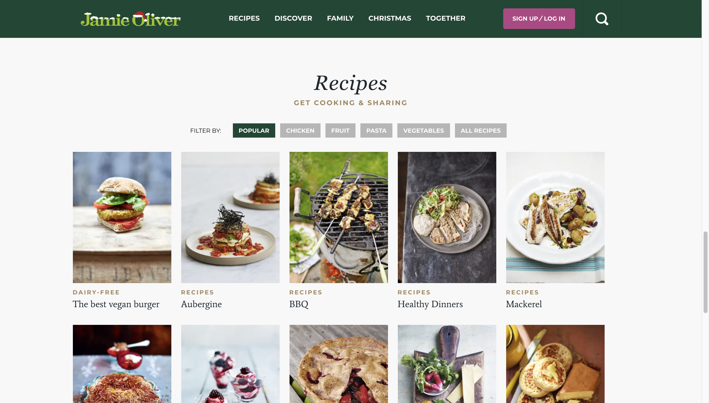
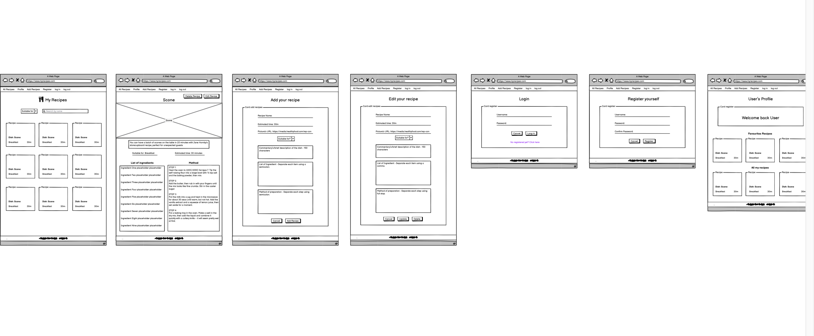
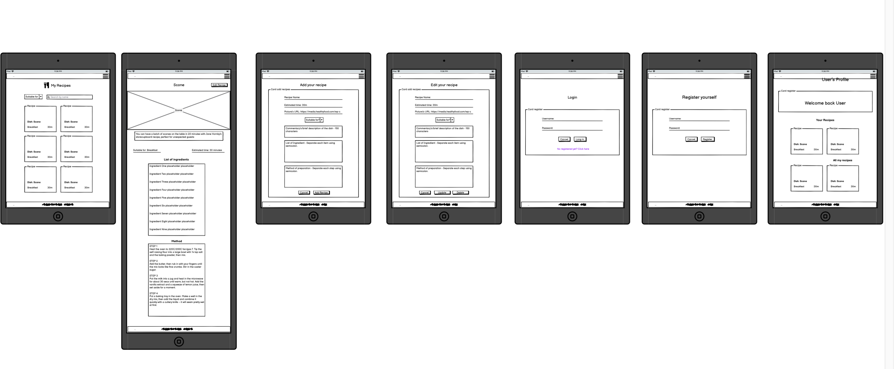
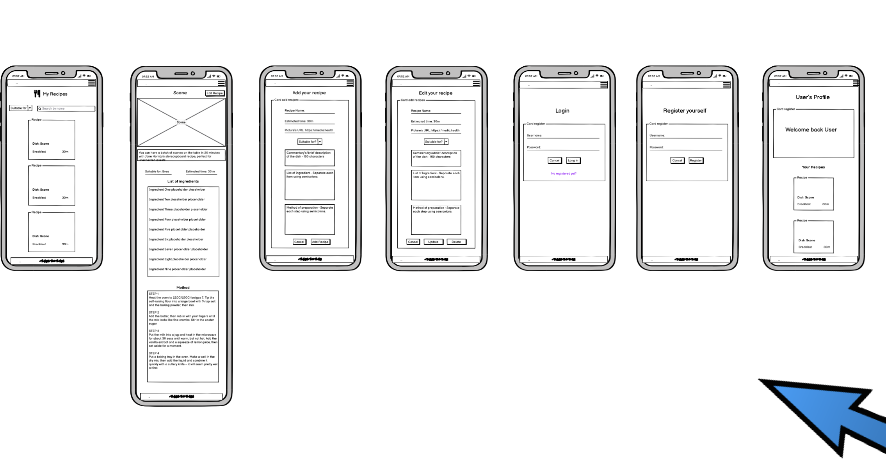
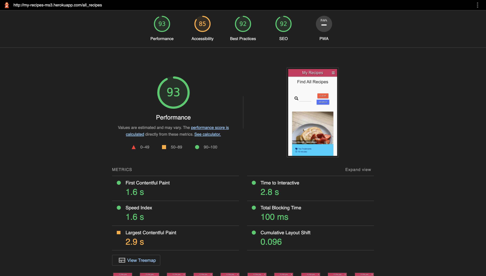
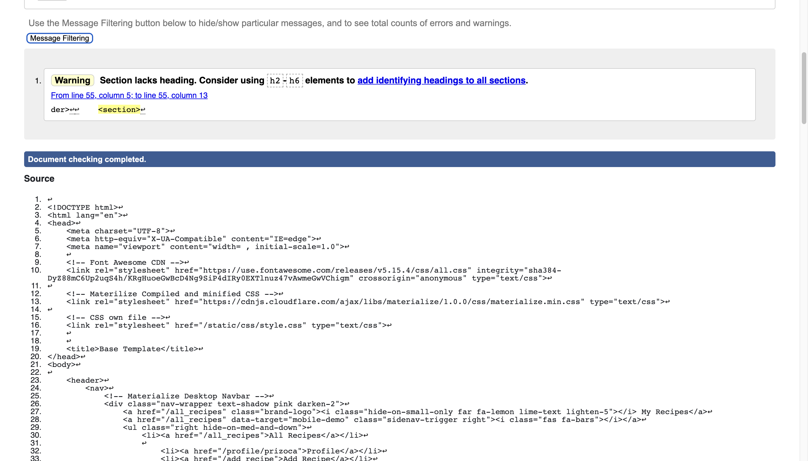
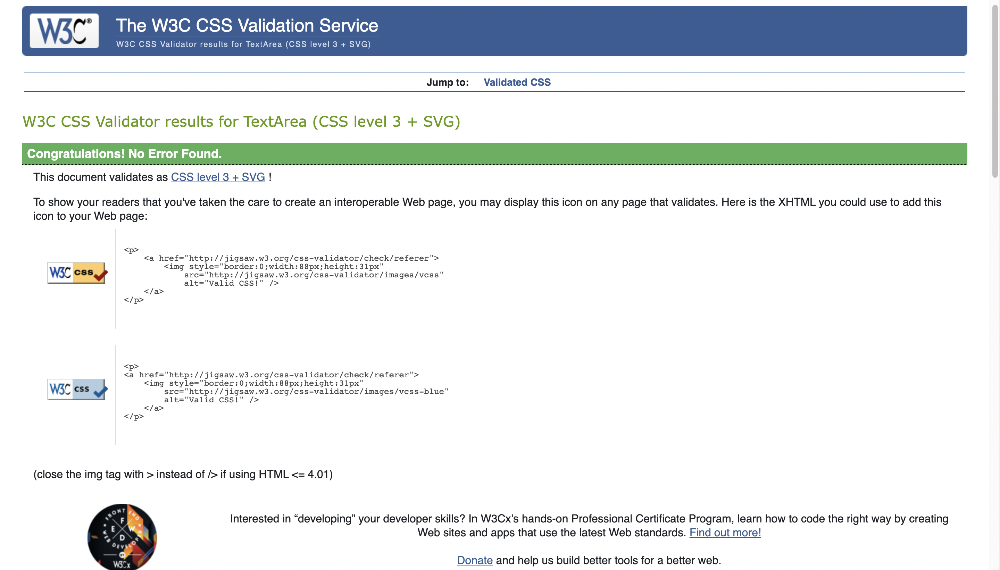
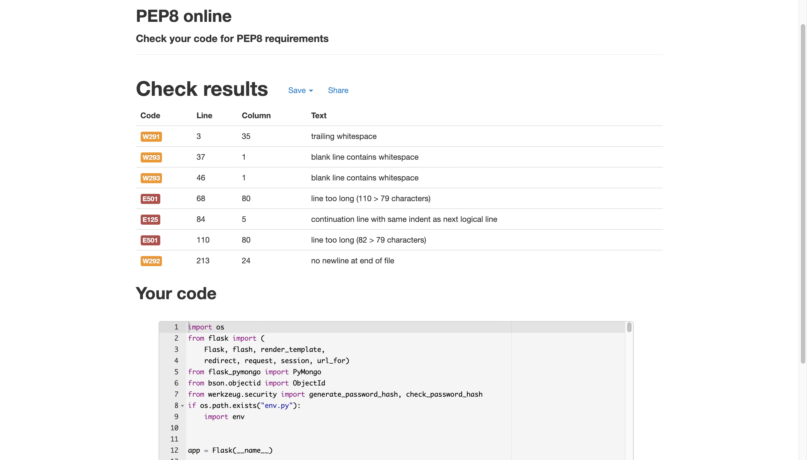
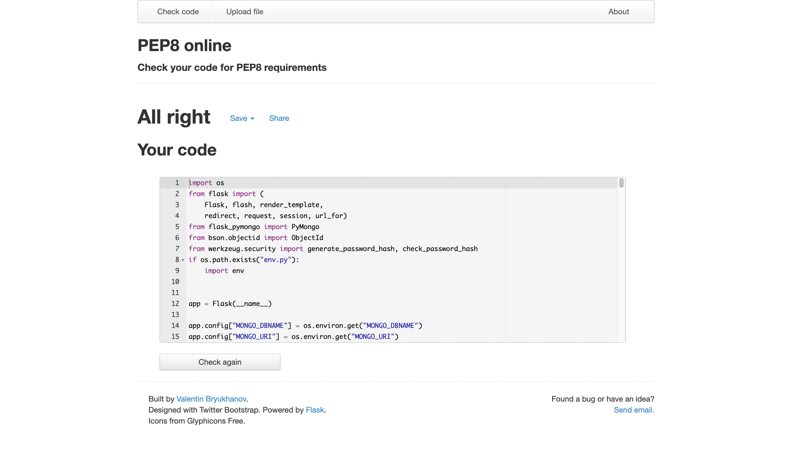

# My Recipe - Online Cookbook


[Live project link](https://my-recipes-ms3.herokuapp.com/all_recipes)

## Project Introduction 

The scope of this project consists in exercise the knowledge learn up to this point with the [Code Institute](https://codeinstitute.net/all-access-coding-challenge/?utm_term=code%20institute&utm_campaign=a%26c_SEA_IRL_BR_Brand_Code_Institute&utm_source=adwords&utm_medium=ppc&hsa_acc=8983321581&hsa_cam=14304747355&hsa_grp=128775288209&hsa_ad=539453915484&hsa_src=g&hsa_tgt=kwd-319867646331&hsa_kw=code%20institute&hsa_mt=e&hsa_net=adwords&hsa_ver=3&gclid=CjwKCAiAvriMBhAuEiwA8Cs5lb4K7BEL5Kg1c8ZXfzdHRSPwEYkb_aMKSzaeFovYBDDbML-RP8UVoBoCyp4QAvD_BwE) -  software development course - and put in practise the conjunction of front end and Backend and also a database, in this case MONGODB, to operate the essential CRUD functionality with a functional app.
 
In this module the focus was to learn Python to work as the main language to manage the backend with the mini framework Flask and the non sequential database MongoDB.

The project idea came from a course suggestion but also a personal wish to provide a simple and functional tool for my wife who works as chef. The project scope allows the user to store her recipes in an organized, safe and accessible way from everywhere. 

Finally this project provided to me some interesting outcomes in my learning process as developer. In this project was possible to learn the fundamentals of [Python](https://www.python.org/), interact with two new frameworks - [Materialize](https://materializecss.com/) and [Flask](https://flask.palletsprojects.com/en/2.0.x/) - as it was possible as well to understand how to query and design a non-relational database - [MongoDB](https://www.mongodb.com/) - to operate CRUD operations and have access a secure informations or also manipulate them. Another important aspect was to practise basic notions in how to build a safe login and logout utilizing[Werkzeug](https://werkzeug.palletsprojects.com/en/2.0.x/).
 
## Table of Contents
1. [UX](#ux)
    1. [User Stories](#user-stories)
    1. [Wireframe](#wireframe)
    1. [Database](#Schema)
1. [Features](#features)
    1. [Existing Features](#existing-features)
    1. [Features Left To Implement](#features-left-to-implement)
1. [Technologies Used](#technologies-used)
1. [Testing](#testing)
    1. [Mannual Tests and Notable Bugs](#mannual-tests-and-notable-bugs)
        - [More than three clicks](#more-than-three-clicks)
        - [Shuffle at any time](#shuffle-at-any-time)
    1. [Responsiveness](#responsiveness)
1. [Deployment](#deployment)
    1. [Making a Local Clone](#making-a-local-clone)
1. [Credits](#credits)
    2. [Media](#media)
    3. [Acknowledgements](#acknowledgements)

## UX

This project borned from the idea to create a simple but functional tool - online cookbook - to help the user in their regular task to store recipes in a safe place and then have access to that information everywhere. With this in mind the UX was taught to accomplish that in an intuitive way but also keeping some visual appeal.

To help with this goal was chosen for me the Materialize framework to keep the constancy of the material design at some point that keeps the things simple and very intuitive. Materialize provides a big range of components, helpers and a good bunch of colors pre-formatat which possiblitated me to concentrate more in the functionality of the app but balancing that with good user experience.

It is important to mention the research done to understand which kind of existing website could help to understand more about the necessities of the user in this area. One website that worked as a reference was the [Jamie Oliver](https://www.jamieoliver.com/). This website sounded like a good answer for the users interested in getting an online recipe. What was noted about that was that the website uses cards with images and has a direct communication about recipe’s information which was understood by me as a good reference thinking about user experience. Normally people interested in online recipes are interested in something quick, where with a few glances at the page they will have all the information needed. For example, how much time, which ingredientes I will need and how to prepare?

<p align="center">

</p>

Pallete for main aspects as cards and navbars:
- #c2185b - class pink darken-2 in Materialize
- ##00e5ff - class cyan accent-3 in Materialize

Pallete for small details and fonts
- Black
- #1a237e - class indigo-text text-darken-4 in Materialize

After a search period and taking in consideration the user stories it was decided to borrow the palette's colors from the classic Game-boy, bringing a certain feeling of nostalgia and the connection with the main user of this application.

Embeded with this concept and the user stories was possible to formulate the framework.

### User Stories

#### External user’s goal
Have their own access to a tool which would possibilitate store their own recipes in a simple, secure and intuitive manner. Also have access to the recipes everywhere they are and or whethever devices.

#### Site owner's goal
Initially offer satisfactory usability of the web application to allow users to keep using the tools and learning the process like a beta test. Later, collect user experience and feedback to improve functionality and eventually create a subscription service.

### Wireframe

As a result of the above, the concept of the website was idealised taking in consideration some research and the user stories. The wireframe was design to deliver all the functions needed to create, read, update and delete the recipes (CRUD actions) but also guaranteeing a basic secure functions just allowing the right user to have access to some of that functions as UPDATE and DELETE, but allowing access to read and create their own recipes.

The initial wireframe consist in: 

1. Navbar with the following options - All Recipes, Profile, Add Recipes, Log in, Log out and Register. Depending on the user in session or not some options will be shown or not.
2. Sidebar with the following options - All Recipes, Profile, Add Recipes, Log in, Log out and Register. Depending on the user in session or not some options will be shown or not.
3. All Recipes home pages consist of a search bar and the all cards that function as quick viewers to the recipes available to everyone. In each card there is a button to access the complete information of the recipe.
4. Each recipe page has an image, general commentary, list of ingredients, method or preparation, time estimated, food tag and who created that recipe. 
5. Add recipe consist of the same information provided in the recipe page but in format of a form to be filled and storaged, plus two buttons cancel and add to action that function.
6. Edit recipe brings all the data filled in the add page with the possibility to edit them and action this function with the addition of three buttons cancel, delete and update.
7. Register page is a form simple page to fill with the credentials to have full access to the functionalities of the website. The inputs necessary are username, password and confirm password. This option was posterior alterated along the developing process to firstname, username, password and confirm password.
8. Login page is a form to allow access and check the users credentials as username and password.
9. User profile is a page to redirect the user after the correct log in where the user has all recipes created by them in one unique space. Over this page they have the possibility to access the full recipe after selecting the recipe quick view card.

See in details clicking on this [Desktop Version](static/assets/project_images/wireframes/original_wireframes/desktop.png)
<p align="center">

</p>

See in details clicking on this [Tablet Version](static/assets/project_images/wireframes/original_wireframes/tablet.png)
<p align="center">

</p>

See in details clicking on this [Mobile Version](static/assets/project_images/wireframes/original_wireframes/mobile.png)
<p align="center">

</p>

## Features

The initial design suffered some fewers changes to accommodate better user experience and the overall functionality of the app. Below are all the actual functionalities that were possible to implement and those which were not possible to do it.
 
1. Navbar & Sidebar for general navigation;

2. All Recipes page - Search function, recipe quick view cards with a button to access the full recipe;

3. Individual recipe page - full visualization of the recipe, for users correct logged in and owner of the recipes Delete and Update function; 
    
4. Profile's page - Welcome message and user's own recipe quick view cards with a button to access the full recipe;

5. Add recipe page - an empty form with all the inputs to add a new recipe and one buttons to action the data insertion;

6. Edit recipe page - a filled form with with recipe’s information with two buttons cancel and update;

7. Log in page - simple form to check the user's credential username and password;

8. Log out page - a navbar link responsabile for end an user session;

9. Register page - a form to collect initial and register the initial user credentials.
    
### Existing Features

#### Base html and Extended usage

The first important feature but one that figures just behind the scenes is the advent of [Jinja-extension](https://jinja.palletsprojects.com/en/3.0.x/templates/?highlight=extend#template-file-extension) which allows a very interesting possibility to create one base html file and then extend its use to all other html templates necessary through the project. This makes easier to implement any update in the html files.

This resource was greatly utilised during the development of this project.

It is possible to block the content you intend to not extend by following the above:

```
<main class="container">
    

    
</main>

```

Then at the top of each new html file it is necessary to extend the base html:

```


```

#### Navbar & Sidebar

- The **Navbar** & **Sidebar** were implemented on this project to complete their functional task to be the main form of navigation through all the possibilities offered by the website. They were designed by Materialize Framework and edited in the visual to match the identity of this project. This feature allows the user to reach links for All Recipes, Profile, Add Recipes, Log in, Log out and Register.

    - If there is no user logged in the navbar will show **All Recipes**, **Log in** and **Register** links.

    - If instead there is an user logged in the links shown will be **All Recipes**, **Add Recipes**, **Profile** and **Log out**.

    This personalised usage in accordance with an user logged or not was possible by an implementation with [Jinja-Template](https://jinja.palletsprojects.com/en/3.0.x/) which empowers the html with logic to check session user a [Flask](https://flask.palletsprojects.com/en/2.0.x/) recourse which allows archiving some information through cookies as the username of the user in question.

    ```
    
        <li><a href="{{ url_for('profile', username=session['user']) }}">Profile</a></li>
        <li><a href="{{ url_for('add_recipe') }}">Add Recipe</a></li>
    
        <li><a href="{{ url_for('login') }}">Log in</a></li>
    
    
        <li><a href="{{ url_for('logout') }}">Log out</a></li>
    
        <li><a href="{{ url_for('register') }}">Register</a></li>
    
    ````

#### All Recipes page 
 In the first place there is a search bar which will look for recipe name or tag name. It is necessary to use the buttons to complete an action such as for finding a recipe pressing the search button or clearing the result bringing back the regular recipes.

These feature was possible thanks to the use of [MongoDB indexes](https://docs.mongodb.com/manual/indexes/) that was created based in the collection recipes but more specifically with the document recipe_name and food_type. 

 ```
recipe_name_text_food_type_text
 ```

 Here it is possible to understand the logic to request the information for mongoDB and then bring the result.
 ```
 <!-- Request the value in the search bar and then replace in the syntax to search in mongodb -->
def search():
    query = request.form.get("query")
    recipes = mongo.db.recipes.find({"$text": {"$search": query}})
    food_tags = mongo.db.food_tags.find().sort("food_type", 1)
 ```

The cards utilized to show the basic information come from [Materialize](https://materializecss.com/cards.html) and they were stylised to being in consonance with the general UX idea. The idealisation of the cards was to summarise the main recipe information in a visual manner. Following this guidance the cards showed the time estimated, name, picture of the recipe, food tag or classification and a link for the full recipe.

#### Cards
 - The **cards** utilised came from bootstrap as well but they were heavily personalised to fit the project criteria’s. Each card is composed for different HTML elements such as:
    - frontFace container in which is contained the image or sprite from Pokemon API.
    - card-body container in which is contained one "h5" tag for the Pokemon name and an "p" tag for the type of the Pokemon request from the API.
    - backface container which is the red part of the card which it is removed after clicking on it.    

#### Scores
 - The **scores** works to countability the number of wrong moves and the number of paired cards found.
    - **Pairs found** increments every two correct cards found by the user at the maximum of 10 because the total of cards are 20.
    - **Movements** increments every two incorrect selection to this score. The less the better.

### Features Left to Implement
- The second phase of the game called battle mode was not possible to implement due the lack of time. The battle mode would consist of after the memory game the user would select six Pokemon from the pool available from the already finished memory game. With this selection of 6 Pokemon the program would randomly choose the equivalent number of Pokemon (6). The user would select the order of reveal of 6 Pokemon and then the disclose or battle between the types would occur one by one (fire vs water). The number of victorious Pokemon would multiply the score of the user.

## Technologies Used

All the Technologies utilised to built this web app can be found bellow with the respective links.

### Languages
- [HTML](https://en.wikipedia.org/wiki/HTML) to build the whole structure of the landing page.
- [CSS](https://en.wikipedia.org/wiki/CSS) to style the webiste.
- [JavaScript](https://en.wikipedia.org/wiki/JavaScript), more specifically [Jquery](https://jquery.com/) was use it to personalize some materialize components.
- [Python](https://www.python.org/) to build majority of the backend instructions on app.py file.

### Frameworks and others

- [Gitpod](https://www.gitpod.io/) as the code editor.
- [Materialize](https://materializecss.com/) for all the core HTML sctrucutes as for buttons, navbar, grid system and helpers to deal with less unique CSS rules and more pre built solutions.
- [Jinja-Template](https://jinja.palletsprojects.com/en/3.0.x/) was utilized in this project as placeholders in the template allowing writing similar Python code on html files to finally render the final document.
- [Flask](https://flask.palletsprojects.com/en/2.0.x/) was used in conjunction with Python to build the functional banckend logic of the web app.
- [MongoDB](https://www.mongodb.com/) is the database for this project where the documents created by user are store as for example the recipes, the user information and food tags.
- [Git](https://git-scm.com/) was used as tool to control the version of the project.
- [Git Hub](https://github.com/) to store the project with versionament control
- [Heroku](https://pages.github.com/) to deploy the live project.
- [Balsamiq](https://balsamiq.com/) to wireframe the ideia of the website.
- [Am I responsive](http://ami.responsivedesign.is/#) to help visualize the webiste in different screens sizes and get a print of it.


## Testing

The automated test utilised were [Google Lighthouse](https://developers.google.com/web/tools/lighthouse) to test general performance, [W3C Markup](https://validator.w3.org/nu/) validation service for the find any inconsistency in the HTML and  [W3C Jigsaw CSS](https://jigsaw.w3.org/css-validator/#validate_by_input) validation service for CSS and [Jshin](https://jshint.com/) for JavaScript.

All the possible erros founded by W3C validators were corrected less those ones being part of bootstrap Frameworks. The same can be said by the Jshin valitadion where there were no errors being displayed.

All the results can be seeing below.

Google Lighthouse results:
<p align="center">

</p>

W3C Markup of all html templates. They were tested and got the same results:
<p align="center">

</p>

W3C Jigsaw CSS for style.css results:
<p align="center">

</p>

The only Javascript utilised in this project was to activate the Materialize components but with Jquery for that reason there is no checker result.

PEP8 Online result before correction for app.py
<p align="center">

</p>

PEP8 Online result after correction for app.py
<p align="center">

</p>

### Mannual Tests and Notable Bugs
The website was manually tested to check if it was working properly. After success attempts I can confirm in the best of my capabilities that the website is working as initially was intend. 

#### More than three clicks
The game provides the capacity to interact with the user through clicking on the cards revealing their content and then checking the value of the cards. If the chosen one is right then will increment one point in the score, but if the selection was wrong the increment will happen in the movements indicating that this selection was wrong. Other than that if the selection was right the user will receive the visual feedback of the cards maintained it revealed, otherwise those cards will be hidden again indicating for the user that they need to try again.

1. All that was tested following the regular flow:
   1. Start the game
   2. Wait two seconds for all cards being loaded
   3. Click on two whised cards and then wait for the visual feedback and increment on the scores or movements.
 
One error found during these tests and already addressed was related to the capacity of the user clicks three or more cards. In that way the logic of the game would be broken resulting in a wrong incrementation of the scores and revealing more than two cards which is not allowed.
 
To solve that was utilised an logic to give boolean value for a global variable called **lockBoard** of false. In the first if statement it is checked if this is true and the function will return and stop the sequence to go on revealing more cards. If the value is false it will go on and at the end of this function will replace the value of **lockBoard** to true for the cycle of checks could happen again.

```
function matchCards (event) {
     if (lockBoard) return;
     if (this === firstCard) return;

    this.classList.remove('backFace');
        
    
     if (!flippedCard) {
         flippedCard = true;
         firstCard = this;
         return;
     }
 
     secondCard = this;
    lockBoard = true;
             
     checkForMatch(firstCard, secondCard);
 }
```
This segment of logic goes on and at the very end where all the variable values were reinstated to the initial states trough the function **resetBoard** to makes the whole sequece works again.

```
function resetBoard() {
    [flippedCard, lockBoard] = [false, false];
    [firstCard, secondCard] = [null, null];
} 
```

#### Shuffle at any time

Another test being executed was to guarantee once more that the logic of the game would not be broken. In this case it is related to the shuffle button that remixes the pokemon array of objects coming from the API through the fetching. This is a feature to guarantee a better mix.

```
function randomPokeArray(event) {
    selectedPokeArray.sort(() => Math.random() - 0.5);
     setTimeout(displayPokeInfo, 200);
}

let btnShuffle = document.getElementById('btnShuffle');
btnShuffle.addEventListener("click", randomPokeArray,randomPokeArray);
```

2. The test consisted in
   1. Start the game
   2. Wait two seconds for all cards being loaded
   3. After that click on the shuffle button.

That made me realize that I was guaranteeing to the user the possibility to change the order of the cards at any time of the game, even after the matching of pairs. That in this case would be breaking the game of increment points for cards that could not be the same any more because the shuffle will make that cards change information and not the position. In this case was possible to for example have a pair of charizard and then click on shuffle and that two cards being displayed as Squirtle and bulbasaur for example.

To avoid that the solution was creat a check attached to the event listener click that would be analysing how many pairs were found through the element where the increment of pair were registered and then being more than 0 the function itself called **disabledBtnShuffle** would be disabling the shuffle button.

```
function enableBtnShuffle(event) {
    btnShuffle.removeAttribute("disabled", "");
}

function disabledBtnShuffle (event) {
    if (parseInt(document.getElementById("score").innerText) > 0){
        btnShuffle.setAttribute("disabled", "")
    }
}
```

Following the same and avoid the shuffle button being displayed before the game could run a similar logic was created. It was given to the html of the button to shuffle the attribute disabled. With that and after listening a event on the button start the function ***enableBtnShuffle** will remove that attribute enabling the button.

```
function enableBtnShuffle(event) {
    btnShuffle.removeAttribute("disabled", "");
}
```

Those two sequences of logic give the button the appropriate functionality to allow the function shuffle just happens up to the moment that the user finds the first pair of cards.

This game or website does not provide any console error because all of them were corrected before the submission.

### Responsiveness

This project was developed to work in a diverse range of screens. All the components from Materialize and it’s Grid system are responsive and were added to them with personalized CSS to improve their capabilities in delivering a better UX and achieve satisfactory usage. With big screens more information will be shown in more comfortable form by the website having enough responsiveness to scale in small screens.

As explained this project will work fine in at least 3 different sizes Desktop,Tablet and mobile. To achieve this the website has been tested on several possible devices, from 11 "or 13" inch Macs, Google Chrome developer tools, variable Android phones of friends and relatives.

## Deployment

To deploy this project I utilised some of the mentioned technologies above to facilitate this process. This project was deployed on Heroku and connected with MongoDB.

### Creating a Repository and installing Flask

1. The first step were created a repository on GitHub with the name **my-recipes-milestone-3**
2. Installed the **Gitpod** extension for **Google Chrome**;
3. Linked **Gitpod** gaving **access** to my **GitHub profile** with my login and password;
4. After that all repositories started to showed the **Gitpod button** just next to the button Code.
5. Clicking in the **Gitpod button** you have access to the code editor linked with this repository.
6. On your recent workspace created in the terminal now it is possible to install Flask. It is necessary to input the following command pip3 Install Flask.
7. You will need to install PyMongo by using the command pip3 install flask-pymongo.
8. And also install dnspython with the command pip3 install dnspython in the terminal.
9. The next step is to create a file called requirements.txt in our root folder. The command in the terminal for that is touch requirements.txt.

### Connecting MongoDB to your repository 
1. First you need to create a free account with [MongoDB](https://www.mongodb.com/).
2. Once created it will be possible to create a new cluster where the database will be seated.
3. In our new cluster we then are allowed to create a database by clicking on the button create a new database.
4. With that and taking in consideration the Schema above it is possible to create all the collections clicking in the button create collection.
5. After this the next step is crucial, that is get back to the gitpod code editor to create a env.py file where sensitive information will be stored and create a secure connection with the database.
6. Create a file in the root of the project called env.py and then input those information below but replacing the key values for "SECRET_KEY", "MONGO_URI" and "MONGO_DBNAME " for their respective information.
```
import os

os.environ.setdefault("IP", "0.0.0.0")
os.environ.setdefault("PORT", "5000")
os.environ.setdefault("SECRET_KEY", ", any secure secret key)
os.environ.setdefault("MONGO_URI", link provided by Mongo DB in accordance with your database and collections information)
os.environ.setdefault("MONGO_DBNAME ", name of you database)
```
7. It will be necessary as well to create .gitignore file or utilising an already one created and list the env.py inside of this file:
```
env.py
```
8. The MONGO_URI you can get by accessing your cluster and then clicking on the connect button.
9. After that you will see an option called "connect your application".
10. In this case select Python and then copy that link and paste as a key valeu for MONGO_URI and replace **password** and **myFirstDatabase** for your Mongo database password and database name in env.py.
11. Do not forget to make the same with the respective values for "SECRET_KEY" and "MONGO_DBNAME".
12. Lastly import the following with an if statement on top of your app.py:
```
import os
if os.path.exists("env.py"):
    import env
```

### Deploying to Heroku

1. The next step is to deploy the project for Heroku.
2. First get back to your gitpod workspace or code editor.
3. To make sure, first save the necessary requirements in the requirements.txt through the command pip3 freeze --local > requirements.txt 
4. Create a procfile with the command 'echo web: python app.py > Procfile' without quotes.
5. Commit those changes to your repository, using git -A, then git commit -m"" and your message and finally git push.
6. Create a Heroku account.
7. On your dashboard you can create a new app hitting new and then create a new app.
8. Choose an app name with dashes -.
9. Choose a region in this case it was Europe.
10. To connect the app with Heroku I chose the option connect with Github.
11. Select the repository name of your project, in my case my-recipes-milestone-3.
12. Go to settings and in the button reveal config Vars.
13. Now the values to be filled will need to match with the values stored in env.py.
```
("IP", "0.0.0.0")
("PORT", "5000")
("SECRET_KEY", ", any secure secret key)
("MONGO_URI", link provided by Mongo DB in accordance with your database and collections information)
("MONGO_DBNAME ", name of you database)
```
14. In the repository and in app.py it it necessary to use this structure to connect finalise the connection with MonogDB, for that it is necessary to pass the informations from to env.py to app.py in a secure form as this:
```
<!-- All the imports necessary  -->
import os
from flask import (
    Flask, flash, render_template,
    redirect, request, session, url_for)
from flask_pymongo import PyMongo
from bson.objectid import ObjectId
from werkzeug.security import generate_password_hash, check_password_hash
if os.path.exists("env.py"):
    import env

<!-- Instances necessary for the connection  -->

app = Flask(__name__)

app.config["MONGO_DBNAME"] = os.environ.get("MONGO_DBNAME")
app.config["MONGO_URI"] = os.environ.get("MONGO_URI")
app.config["SECRET_KEY"] = os.environ.get("SECRET_KEY")


mongo = PyMongo(app)
```
15. Go back to Heroku and click Enable Automatic deployment, keep the main branch selected and then click in deploy and wait until it finalises the process.
It is done.


### Making a Local Clone

1. Log in to your [GitHub](https://github.com/), locate the repository [pedromn0/my-recipes-milestone-3](https://github.com/pedromn0/my-recipes-milestone-3).
2. Inside the repository locate the button Code and then click on "Clone or download".
3. To clone the repository using HTTPS, under "Clone with HTTPS", copy the link.
4. In your terminal open Git Bash.
5. Then you can change the current working directory to a directory that suits you in your computer.
6. Type `git clone`, and then paste the URL you copied earlier.


## Credits

All images utilised to fill some recipes were taken from the same source the [Jamie Oliver](https://www.jamieoliver.com/) website as the content of the recipes as well.

A significant part of the main structure code has been written following [Code institute task manager - mini project](https://learn.codeinstitute.net/)

A variety of components of this Project came from [Materialize](https://materializecss.com/) as Moodal, Grid sytem, image-cards, pallet of colours, Navbar and SideNav, Footeres, Forms and also some CSS helpers and styles.

Code instiute Slack channel was utilised as a referece to solve one bug related to how to correct populate a textarea html tag coming from my MongoDB and a collection which is stores data as an array. The ideia is keep each array index as a line inside textarea html tag.

```
<textarea placeholder="One item per line;" id="ingredients_list" name="ingredients_list" class="materialize-textarea">

<!-- This if but not the for loop -->
 
     
        {{ ingredient }} &#13;&#10;
    
</textarea>
```

### Media

- Only one image has a different source, this pciture was utilised as an standard picture in case the user do not paste any Picture URL in the add recipe form. This is the [reference](https://www.pinterest.ie/pin/846395323697472657/) for that image as a source being Pinterest.

<p align="center">

</p>

- [FontAwesome](https://fontawesome.com/) was utilised for all small icons to enhance the visual of the webiste. 

- The Pokeball image utilised called [pokeLogo](https://www.pikpng.com/pngvi/xxRxTm_brik-pixel-art-pokemon-pokeball-clipart/) in the project came from this website https://www.pikpng.com/

### Acknowledgements

- It is important to note all the support from my mentor Chris Quin which helped me since the beginning to guide me and instruct me through some difficulties.